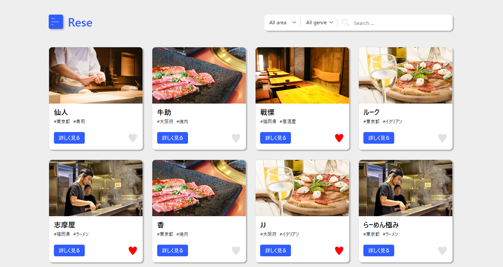
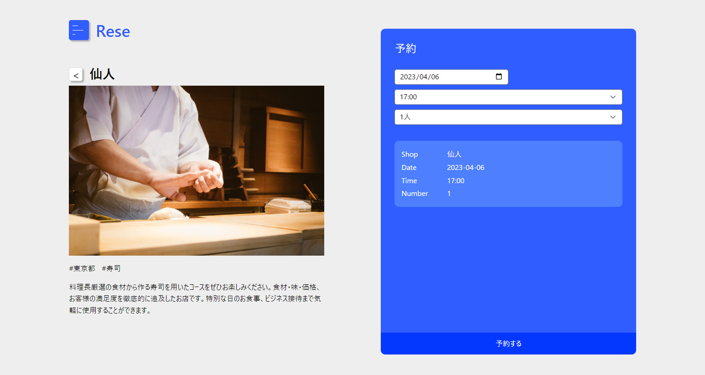
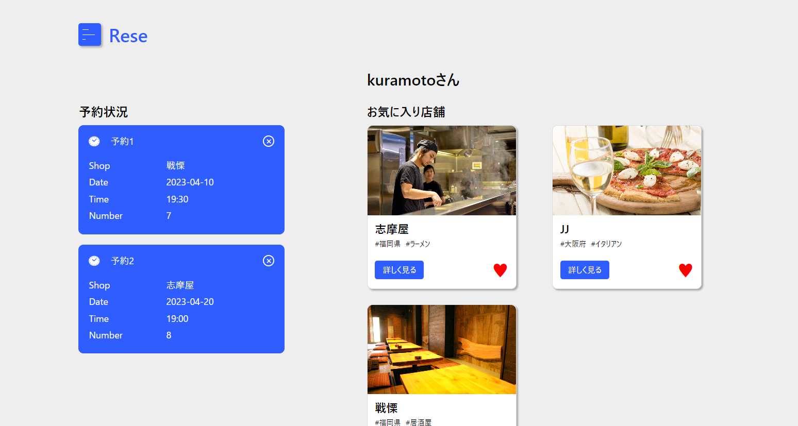
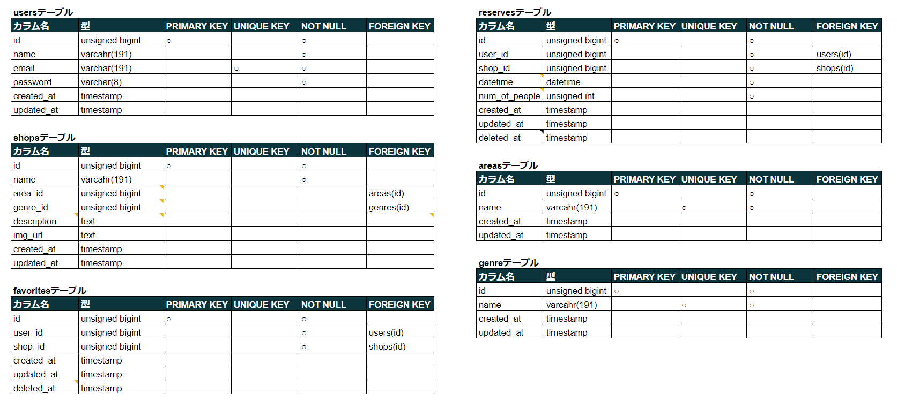
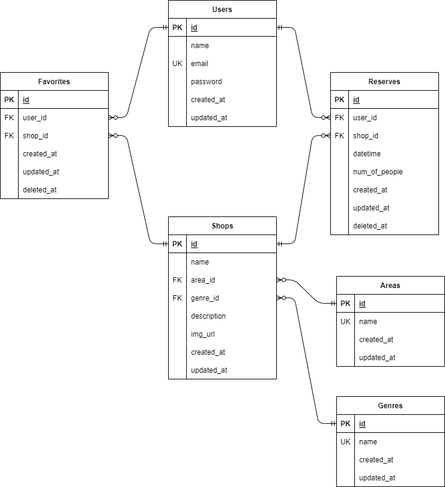

# Rese (リーズ)
ある企業のグループ会社の飲食店予約サービス.





## 作成した目的.
他社の同系統サービス利用時の手数料を抑えるため、自社用のサービスを作成.
(CoachTechの模擬案件課題として作成)

## 機能一覧.
- 店舗一覧表示機能
- 店舗詳細情報表示機能
- 店舗検索機能(タグ、店名)
- ユーザー機能
  - ログイン機能
  - 登録機能
  - 予約機能
  - 店舗お気に入り機能

## 使用技術
- Laravel 8.x
  - Laravel breeze
  - php 8.1
  - Vue.js
- MySQL
- AWS Linux
  - EC2

## テーブル設計


## ER図


# 環境構築
開発環境での実行手順(Laravelがインストールされている前提)
- 適切な場所にリポジトリを取得.
- コマンドラインにて`mysql`を実行、対象のデータベースを作成.
```
$ mysql -u root -p
Enter :

mysql> CREATE DATEABASE データベース名
```
- `.env`ファイルを`.env.example`をコピーして、下記にデータベース名を記載.
```
DB_DATABASE=データベース名
```

- プロジェクトディレクトリに移動し、マイグレーションを実行.
```
$ php artisan migrate
```

- シーディングを下記の順に実行
```
// 先に実行.
$ php artisan db:seed --class=AreasTableSeeder 
$ php artisan db:seed --class=GenresTableSeeder 

// 上記2つのテーブルを利用するため、後に実行.
$ php artisan db:seed --class=ShopsTableSeeder 
```

- 下記コマンドで実行、ブラウザで起動確認.
```
$ php atisan serve
```

## その他
- テーブルレコードを増やす方法
  - `public/csv/*List.csv`に追記して、シーディング実行
  - 同一のレコードは作成しない仕様になっているので、追記のみで可

- お気に入り機能のコンポーネント編集方法
  - `resource/js/components/FavoriteComponent.vue`にて変更・編集が可能
  - 編集後は下記コマンドを実行し、変更をコンパイルする必要がある
```
$ npm run dev  // 開発環境.
$ npm run prod // 製品環境.

// 上記を行ってから、ブラウザで確認.
$ php artisan serve
```

### 追加実装項目

- バリデーション
  - RegisterRequest : 登録
  - LoginRequest   : 認証
  - ReserveRequest : 予約
  - SearchRequest : 検索

- ストレージ
  - URL先から取得した画像をStorageに保存.
  - public/storage にlinkを作り、そのファイルを参照して表示.

- AWS
  - ストレージ(S3) : 未達成 (画像のアップロードはできたが、参照ができなかった)
  - バックエンド(EC2) : 達成 (インスタンス先のURL-> `http://3.27.16.185/`)
  - データベース(RDS) : 達成 (EC2からRDSのデータベースにmysql通信)

- (環境の切り分け)
  - ストレージの処理の合わせて、ほんの少しだけ利用
  - isLocal()とisProduction()を利用、ストレージ先を`local`と`s3`で分けようとした
